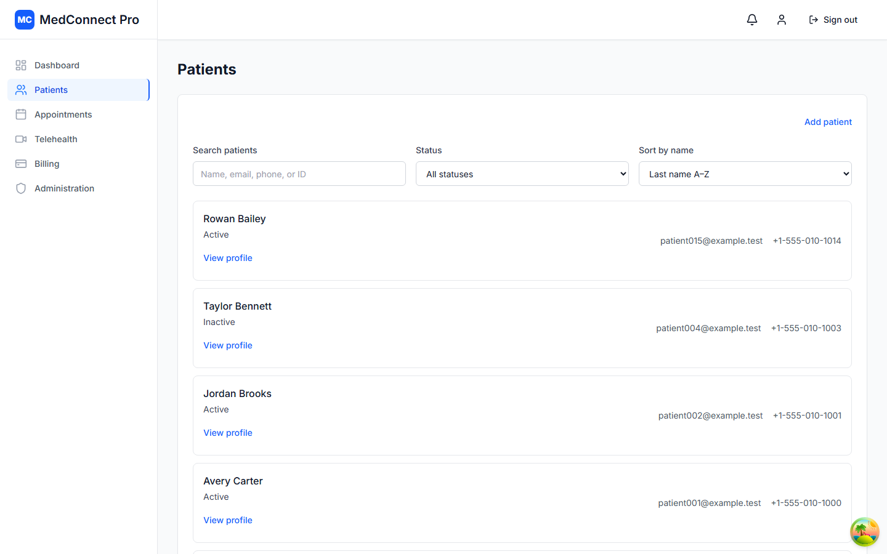
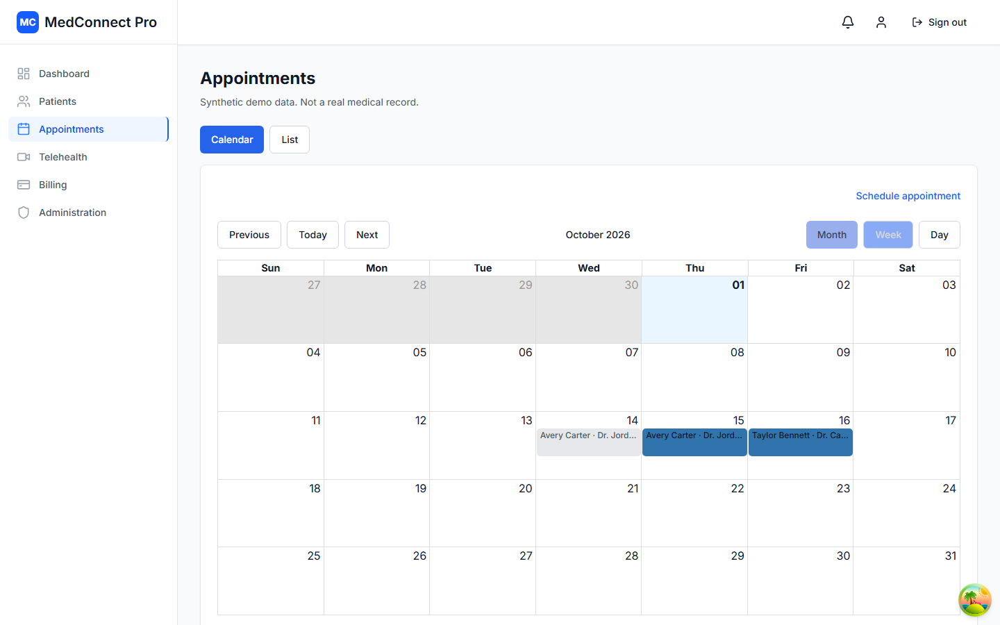
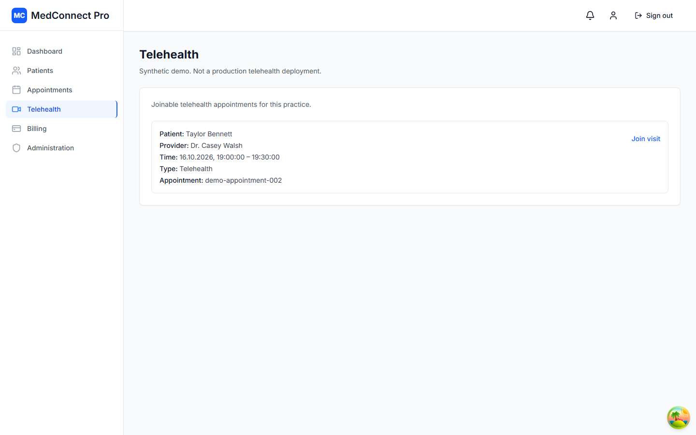
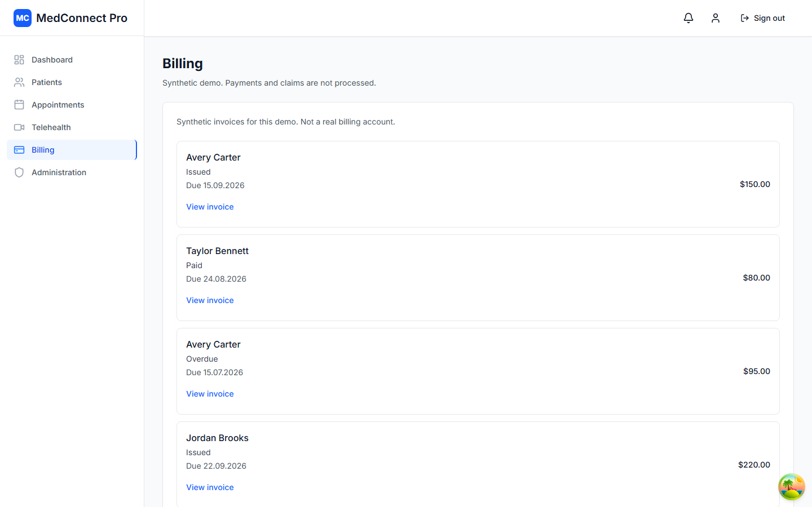
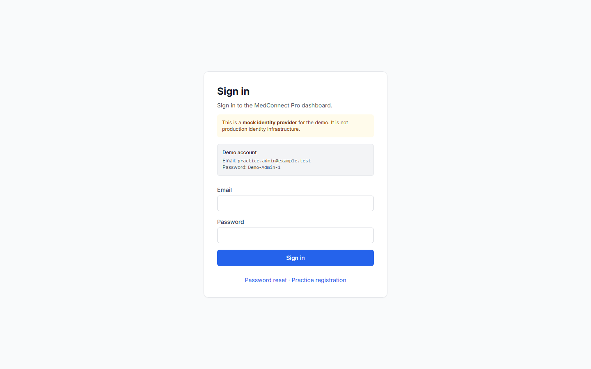
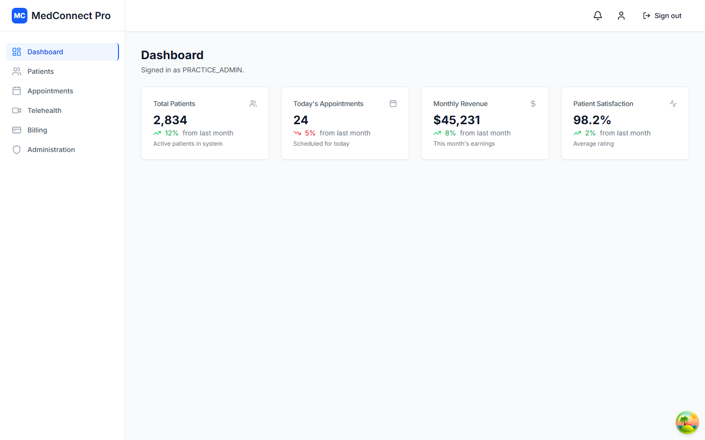
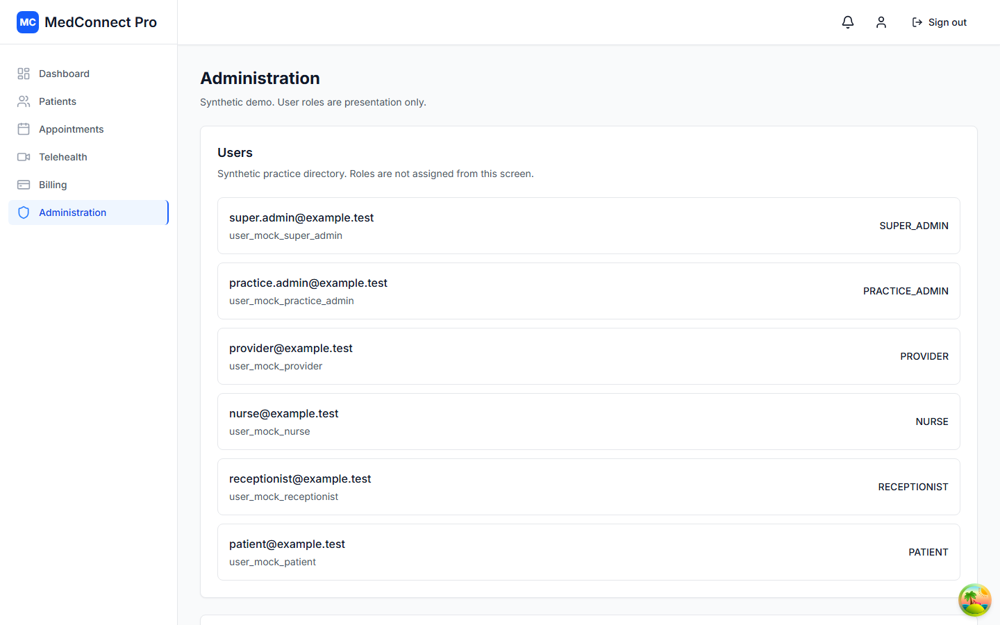
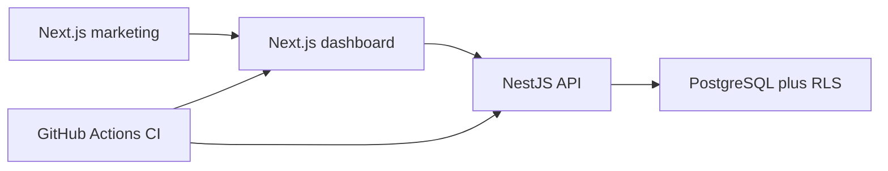

# MedConnect Pro

Feature-rich healthcare SaaS **demonstration** for portfolio, technical interviews, and
potential-client presentations.

The repository is a multi-tenant practice platform: a Next.js dashboard and public marketing
site, plus a modular NestJS API with RBAC, PostgreSQL row-level security, and audit logging.
Engineering is production-oriented. This is **not** a deployed healthcare service.

Canonical product, architecture, contract, and task documentation lives in
[`/docs`](./docs/README.md).

## Disclaimer

All records, credentials, and clinical content are **synthetic demo data**. Do not introduce real
patient records, identifiers, or other PHI ([ADR-005](./docs/decisions/ADR-005-synthetic-demo-data.md)).

Healthcare-oriented and HIPAA-oriented describe demonstrated engineering patterns. The demo is
**not** HIPAA certified, HIPAA compliant, or suitable for real patient data.

## Screenshots

Synthetic demo screens from the authenticated app. Not a production medical record. Dashboard
cards are live Nest aggregates in `dev:real` (fixture cards when mocks are on); telehealth is a session shell (not live video); identity is a labeled mock IdP.

<p align="center">
  
</p>

<table>
  <tr>
    <td width="33%">
      
    </td>
    <td width="33%">
      
    </td>
    <td width="33%">
      
    </td>
  </tr>
</table>

<details>
<summary>More screenshots</summary>

<table>
  <tr>
    <td width="33%">
      
    </td>
    <td width="33%">
      
    </td>
    <td width="33%">
      
    </td>
  </tr>
</table>
</details>

## Key capabilities

What you can demonstrate **today**. Statused catalog:
[`docs/product/`](./docs/product/README.md). Public-claim ceiling:
[`docs/marketing/capability-matrix.md`](./docs/marketing/capability-matrix.md).

| Module | In the demo | Limit |
| --- | --- | --- |
| Identity | Mock IdP login, logout, and opaque bearer sessions | Not production OAuth / OIDC; MFA challenge is not completed in the live UI |
| Patients | Directory, profiles, clinical lists, document list/download | Synthetic data only; no external EHR |
| Scheduling | Calendar, appointments, provider availability | No waitlist or check-in / check-out |
| Telehealth | Create, join, and end an appointment-linked session shell | Not live video, Daily media, chat, or recording |
| Billing | Invoice list and detail | Not hosted payments or claims submission |
| Analytics | Live Nest dashboard overview cards | Synthetic demo aggregates; not a warehouse or HIPAA analytics |
| Administration | User directory, audit viewer, and role assignment with tenant/grant limits | Not a permission-matrix editor; security-events HTTP remains M11 |
| Security | Server-side RBAC, tenant isolation (including RLS), audit logging, document ACL | Not HIPAA certification |

Notification **in-app inbox** exists on the dashboard Bell (session user only). It is not push,
SMS, or email delivery.

## Tech stack

### Frontend (`apps/web`)

- Next.js App Router, React, TypeScript
- TanStack Query
- React Hook Form + Zod
- Tailwind CSS, Headless UI, Lucide React
- Recharts, React Big Calendar

Daily SDK and Socket.IO client are in the tree as boundaries. Live telehealth media and
application realtime are **not** wired.

### Backend (`apps/api`)

- Node.js current LTS, NestJS 12, TypeScript
- REST + OpenAPI (`npm run openapi:generate`, `/api/docs-json`, optional `/api/docs`)
- PostgreSQL 18 (local Compose + TypeORM, including RLS)

Redis, S3/KMS as a local runtime, WebSockets / Socket.IO, and WebRTC / Daily media are **not**
wired in the running demo.

### Infrastructure in the repository

- Docker Compose for local PostgreSQL
- GitHub Actions quality gates on pull requests and `main`
  ([`.github/workflows/ci.yml`](./.github/workflows/ci.yml))
- Terraform ([`infra/terraform/`](./infra/terraform/)), Amplify buildspec
  ([`amplify.yml`](./amplify.yml)), ECS production workflow
  ([`.github/workflows/production-deploy.yml`](./.github/workflows/production-deploy.yml))

Hosted Amplify + ECS is coded; first AWS apply is still an operator step. Do not describe the
demo as hosted on AWS.

ADRs: [`docs/decisions/`](./docs/decisions/).

## Architecture

Implemented local / CI path. Marketing and dashboard share the Next.js app; Nest owns
authorization and data.



Amplify Hosting and ECS/Fargate exist as infrastructure-as-code for a later operator apply
([INFRA-014](./docs/tasks/infrastructure/INFRA-014-aws-account-setup-and-hosted-first-apply.md)).
They are not a live public deployment.

## Development status

Application version **0.59.0**. Snapshot:
[`docs/roadmap/post-mvp-baseline.md`](./docs/roadmap/post-mvp-baseline.md).

- **M0–M8 shipped**, including the public marketing site (FE-017–FE-023).
- **M9 — Deployment / preview infrastructure** is **PAUSED / BLOCKED** — AWS account setup
  unavailable. Not closed and not cancelled: INFRA-004–INFRA-012 shipped, INFRA-014 pending
  (blocks INFRA-013), INFRA-013 paused.
- Next product module is **M11** (planned; no task IDs). Local product work does not wait on AWS.

Deferred relative to the complete-product vision: production OAuth 2.0 / OIDC + PKCE, live
video, hosted payments and claims, Redis, and HIPAA certification (out of scope for this demo).
M10 role assignment HTTP and UI are shipped (DATA-002, BE-011, FE-024, BE-012, FE-025, BE-013,
FE-026).

## Deployment / demo

The runnable demo is **local**. There is no public hosted URL.

- UX-only: `npm run dev:mocks`, then [http://localhost:3000](http://localhost:3000).
- Live Nest: Compose PostgreSQL, migrations, `seed:mock-identity`, `dev:api`, `dev:real`.
  Commands are in [Getting started](#getting-started).

CI quality gates already run on pull requests and `main`. Preview/production topology is
[ADR-012](./docs/decisions/ADR-012-deployment-topology.md). Operator AWS first-apply, Amplify
console connect, and the GitHub `production` environment remain required before a hosted demo
exists. All environments, if applied later, stay synthetic/demo only.

## Repository layout

This repository is an **npm workspaces** monorepo.

```text
medconnect-pro/
  apps/web/          Next.js frontend
  apps/api/          NestJS API (platform foundation)
  apps/api/openapi/  Generated OpenAPI (`npm run openapi:generate`)
  packages/          Reserved for future shared packages
  postman/           Postman environments and collection conventions
  docs/              Canonical documentation
  infra/terraform/   M9 Terraform root (secrets, RDS, ECS)
  amplify.yml        Amplify Hosting buildspec for apps/web
  .github/workflows  GitHub Actions quality gates (`ci.yml`)
  .cursor/rules/     Project Cursor rules
  scripts/plane/     Plane task sync
```

The backend is a **separate modular NestJS application** under `apps/api`. Do not fold backend
domain logic into the Next.js app.

Frontend role and nav checks are UX only. Server-side authorization and tenant isolation in
`apps/api` are the authoritative controls.

## Security model

The demo models healthcare-oriented engineering patterns. **Implemented:** mock IdP sessions, mock
MFA challenge, RBAC and resource-level authorization, tenant isolation (including PostgreSQL RLS),
audit logging, least-privilege database role, secrets outside source control.

**Target, not implemented:** OAuth 2.0 / OpenID Connect (Authorization Code + PKCE), production MFA,
encryption at rest as an infrastructure property, TLS at the deployment edge.

The frontend may use a **mock identity / session** for demonstration. Mock authentication is not
production identity infrastructure.

### Roles

`SUPER_ADMIN`, `PRACTICE_ADMIN`, `PROVIDER`, `NURSE`, `RECEPTIONIST`, `PATIENT`

Authorization follows: identity → tenant / practice → role → permission → resource
ownership or assignment.

## Getting started

Local development is the Next.js app in `apps/web` (mock-first) plus the NestJS API in `apps/api`.
PostgreSQL is Docker Compose at the repository root (`docker compose up -d`, image
`postgres:18-alpine`). Redis is not part of this setup.

### Prerequisites

- Node.js **24** (Active LTS). See `.nvmrc` and the root `package.json` `engines` field.
- npm **10.x** or later
- Docker (for local PostgreSQL)

### Installation

1. Clone the repository.
2. Copy [`apps/web/.env.example`](./apps/web/.env.example) to `apps/web/.env.development`. Do not
   commit `.env.development`, `.env.test`, or secrets. For Vitest/Playwright local overrides, copy
   the example to `apps/web/.env.test` and set mock delay/error rate to `0` as noted in that file.
3. Install dependencies from the **repository root**:

```bash
npm install
```

4. Start local PostgreSQL and apply migrations (owner role). Nest runtime must use `medconnect_app`
   (`DATABASE_URL` in [`apps/api/.env.example`](./apps/api/.env.example)); do not point it at the
   table owner or row-level security is bypassed:

```bash
docker compose up -d
npm run migration:run
```

5. Start the frontend with mocks for UX-only work:

```bash
npm run dev:mocks
```

6. For live Nest APIs, start PostgreSQL (step 4), seed demo identity, start the API, then the
   frontend with mocks off:

```bash
npm run seed:mock-identity
npm run dev:api
npm run dev:real
```

7. Open [http://localhost:3000](http://localhost:3000).

`npm run dev` starts Next.js using `.env.development` (mock-first in the example).
`npm run dev:real` sets `NEXT_PUBLIC_USE_MOCKS=false`. The browser then calls Nest at
`NEXT_PUBLIC_API_BASE_URL` (default `http://localhost:3001`) with the bearer from `POST /auth/login`.
Live dashboard overview cards use Nest `GET /dashboard/overview`. Mock mode still renders fixtures.
The same commands exist as `dev:web` aliases.

### Local versus hosted

Local development (`APP_ENV=local`) uses Compose PostgreSQL and the committed `.env.example`
files. It does not require AWS credentials. Preview and production are separate hosted
environments with isolated demo databases
([ADR-012](./docs/decisions/ADR-012-deployment-topology.md),
[environment-configuration.md](./docs/contracts/environment-configuration.md)). Copy
`.env.preview.example` / `.env.production.example` only as placeholders; real
`.env.preview` / `.env.production` stay gitignored. Hosted API boot fails closed if database
URLs are missing or still point at Compose. All three databases are synthetic/demo only.

### Useful commands

Run these from the repository root:

```bash
npm run lint
npm run lint:api
npm run type-check
npm run type-check:api
npm test
npm run test:api
npm run test:watch
npm run test:coverage
npx playwright install chromium   # once per machine, before E2E; run from apps/web if needed
npm run e2e
npm run build
npm run build:api
npm run clean                     # Next.js/test output under apps/web
npm run reset                     # clean + reinstall node_modules (cross-platform)
npm run dev:api                   # NestJS API on http://localhost:3001
npm run openapi:generate          # Write apps/api/openapi/openapi.json
npm run migration:run             # Apply TypeORM migrations to local Postgres
```

Pull requests and pushes to `main` run the same lint, type-check, test, and build commands via
[`.github/workflows/ci.yml`](./.github/workflows/ci.yml) (plus `npm run migration:run` before
`test:api`, and `npm audit --omit=dev`). Playwright e2e is local/release smoke, not every PR.
A failing quality-gate step fails the workflow. Mark the `ci` GitHub check required on `main` so
merges stay fail-closed.

Frontend testing conventions: [docs/workflows/frontend-testing.md](./docs/workflows/frontend-testing.md).

API contracts and Postman: [docs/workflows/api-contract-workflow.md](./docs/workflows/api-contract-workflow.md).
`npm run dev:api`, `npm run test:api`, and `npm run openapi:generate` are available. Import
`apps/api/openapi/openapi.json` into Postman as **MedConnect Pro API**.

## Documentation

| Path | Purpose |
| --- | --- |
| [`docs/README.md`](./docs/README.md) | Documentation map and source-of-truth hierarchy |
| [`docs/00-project-spec.md`](./docs/00-project-spec.md) | Project identity, goals, and constraints |
| [`docs/product/`](./docs/product/README.md) | Statused capability catalog (what the demo is today) |
| [`docs/marketing/capability-matrix.md`](./docs/marketing/capability-matrix.md) | Public-claim ceiling |
| [`docs/architecture/`](./docs/architecture/) | System structure |
| [`docs/decisions/`](./docs/decisions/) | Architectural decision records |
| [`docs/contracts/`](./docs/contracts/) | API, identity, and environment contracts |
| [`docs/roadmap/post-mvp-baseline.md`](./docs/roadmap/post-mvp-baseline.md) | M0–M8 shipped snapshot; M9 paused; M10 next |

Process prompts, tasks, and remaining workflows are linked from
[`docs/README.md`](./docs/README.md). Plane can mirror task metadata; Git remains canonical for
requirements, architecture, ADRs, and task definitions.

## License

Proprietary — all rights reserved.
